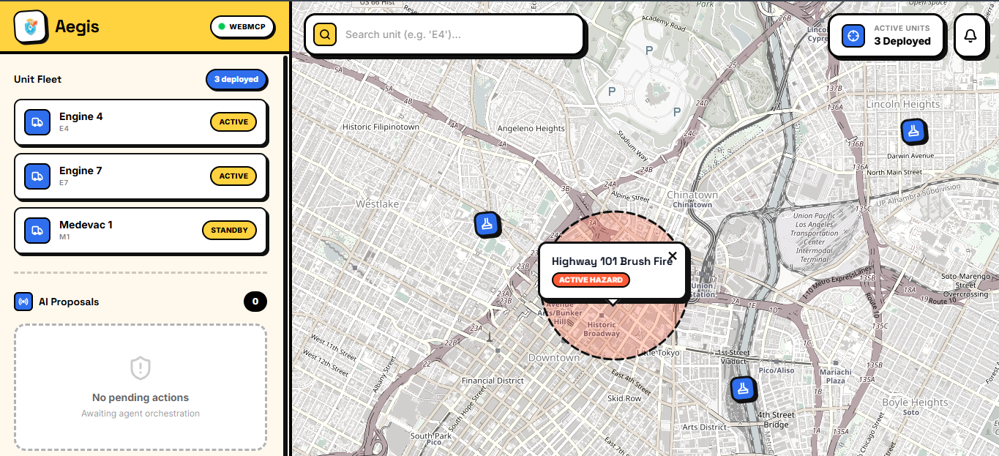

<p align="center">
  
</p>

<h1 align="center">Aegis</h1>
<p align="center"><b>Agent-Native Emergency Dispatch — built for The WebMCP Challenge by OpenAI</b></p>

<p align="center">
  <a href="https://aegis-webmcp.vercel.app/"></a>
  
  
  <a href="LICENSE"></a>
</p>

<p align="center">
  
</p>

<p align="center">
  <a href="https://aegis-webmcp.vercel.app/"><b>Live Demo</b></a> ·
  <a href="#-demo-video">Demo Video</a> ·
  <a href="#-how-it-works">How It Works</a> ·
  <a href="#-quick-start-for-judges">Quick Start for Judges</a> ·
  <a href="#-tech-stack">Tech Stack</a>
</p>


## What is Aegis?

**Aegis is a 911 dispatch map that an AI agent can act on directly — through WebMCP — while a human dispatcher keeps final approval over every change.**

During a wildfire, flood, or earthquake, dispatchers take radio calls like *"the wind shifted, Engine 4 is trapped"* and then have to manually translate that into an updated map: find the right tool, draw a hazard polygon, search a database for the unit, change its status, open a separate app to send an evacuation alert. That process typically takes two to three minutes. In a fast-moving wildfire, that gap costs lives.

Aegis closes that gap. An AI agent (ChatGPT, using WebMCP) listens to the dispatch transcript, discovers the tools exposed on this page, and drafts the exact map actions — hazard zones, unit status changes, relocations, deployments, evacuation alerts. Nothing goes live until a human dispatcher clicks **Approve**.

Built for **[The WebMCP Challenge by OpenAI](https://webmcp.devpost.com)** — an emerging open standard that lets web apps expose structured, agent-callable tools instead of leaving agents to guess their way through a UI.


## Who this is for

Aegis is built for **emergency dispatch operators and incident commanders** — the people who take the first chaotic radio call in a disaster and have to turn it into a coordinated, accurate response in seconds, not minutes. It's a demonstration of what dispatch software looks like when an AI agent handles the data entry and a human keeps the authority to act.


## 🎥 Demo Video

**[Watch the 3-minute demo on YouTube →](https://youtu.be/UX1HIA71sPI)**

The video walks through a live radio call being parsed by ChatGPT, WebMCP tools firing in real time, the human-approval queue, and the map updating live.


## 🚨 How It Works

1. **A radio call comes in.** A dispatcher pastes (or eventually speaks) the transcript to an AI agent.
2. **The agent discovers Aegis's tools.** Using `document.modelContext.registerTool`, Aegis exposes five strict, schema-typed tools directly on the page — no scraping, no guessing at buttons.
3. **The agent drafts actions, it doesn't execute them.** Every tool call fires a `CustomEvent` into a **Pending Actions Queue** in the sidebar. The agent never touches the live map or database directly.
4. **A human approves.** The dispatcher reviews each drafted action and clicks Approve or Reject. Only then does React state update — and the map animates the change live (units physically drive to their new position instead of teleporting).

This is the core design principle: **the agent reasons, the human decides.**

### The five WebMCP tools

| Tool | What it does |
|---|---|
| `draft_hazard_zone` | Draws a hazard/fire zone at exact coordinates with a radius |
| `update_unit_status` | Flags a unit's status (e.g. Code Red for a trapped engine) |
| `relocate_unit` | Moves an existing unit to new coordinates |
| `deploy_unit` | Spawns a new unit onto the map |
| `draft_evacuation_alert` | Prepares a broadcast alert for a named sector |

```javascript
await document.modelContext.registerTool({
    name: 'draft_hazard_zone',
    description: 'Draft a new hazard zone on the map for human approval.',
    inputSchema: {
        type: 'object',
        properties: {
            name: { type: 'string' },
            lat: { type: 'number' },
            lng: { type: 'number' },
            radius: { type: 'number' }
        },
        required: ['name', 'lat', 'lng', 'radius']
    },
    async execute(input) {
        // Never mutates state directly — fires across the event bridge instead
        window.dispatchEvent(new CustomEvent('aegis-agent-action', {
            detail: { type: 'HAZARD', data: input }
        }));
        return { content: [{ type: 'text', text: 'Drafted hazard zone.' }] };
    }
});
```

Every `inputSchema` requires typed, structured fields (numbers for coordinates, strings for names) so the agent can't pass malformed or ambiguous data onto a live emergency map.


## 🧭 Quick Start for Judges

You can test Aegis live in under a minute using the ChatGPT Desktop app's in-app browser, which supports WebMCP out of the box.

1. **Open ChatGPT Desktop** and make sure your selected model supports WebMCP tool calling.
2. **Ask ChatGPT to open** `https://aegis-webmcp.vercel.app` in its in-app browser.
3. **Paste this radio call as a prompt:**

   > "Command, Battalion 2! The fire is spreading out of control. Relocate Engine 4 to Lat: 34.030, Lng: -118.230 immediately! Deploy a new unit called 'Dozer 1' (ID: D1) at Lat: 34.040, Lng: -118.220. Mark a hazard zone named 'Exit 14 Fire' at 34.062, -118.258 with a 600m radius. Use the WebMCP tools available on this page to respond."

4. **Watch the sidebar.** The agent will draft three actions into the Pending Actions Queue.
5. **Click Approve** on each action and watch the map update — Engine 4 drives to its new position, Dozer 1 spawns in, and the hazard zone is drawn.


## 🛠️ Tech Stack

- **Framework:** Next.js 16 (App Router), React 19
- **Styling:** Tailwind CSS v4
- **Map engine:** React-Leaflet (OpenStreetMap tiles)
- **Agent integration:** [`@mcp-b/webmcp-polyfill`](https://www.npmjs.com/package/@mcp-b/webmcp-polyfill), `document.modelContext` API
- **State:** React state + a custom event bridge (Pending Actions Queue) as the sole path from agent action to UI mutation


## 💻 Local Development

```bash
git clone https://github.com/YOUR_USERNAME/aegis-webmcp.git
cd aegis-webmcp
npm install
npm run dev
```

Open [http://localhost:3000](http://localhost:3000). To test WebMCP locally in Chrome, enable it at `chrome://flags/#enable-webmcp-testing`.


## ⚙️ Design Notes: Why Human-in-the-Loop

An AI agent is genuinely good at semantic reasoning — understanding that "Engine 4 is trapped" means its status should become Code Red. It is not the right thing to trust with unsupervised writes to a live emergency-response system. Aegis's entire architecture is built around keeping those two facts separate: the agent drafts intent, and only a human click commits it. There is no code path in this repo where a WebMCP tool call reaches the map without passing through the approval queue.


## 🗺️ What's Next

The transcript step is currently manual. The next version replaces it with live WebRTC audio: transcribing real radio traffic in real time and feeding it continuously to the WebMCP agent, so the map updates as the radio chatter comes in — with the same human-approval queue standing between the agent and the live map.


## 📄 License

Aegis is open source under the [MIT License](LICENSE).

<p align="center">
  <sub>Built for <a href="https://openai.com">The WebMCP Challenge by OpenAI</a></sub>
</p>
